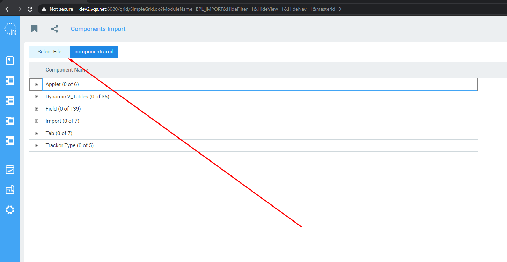
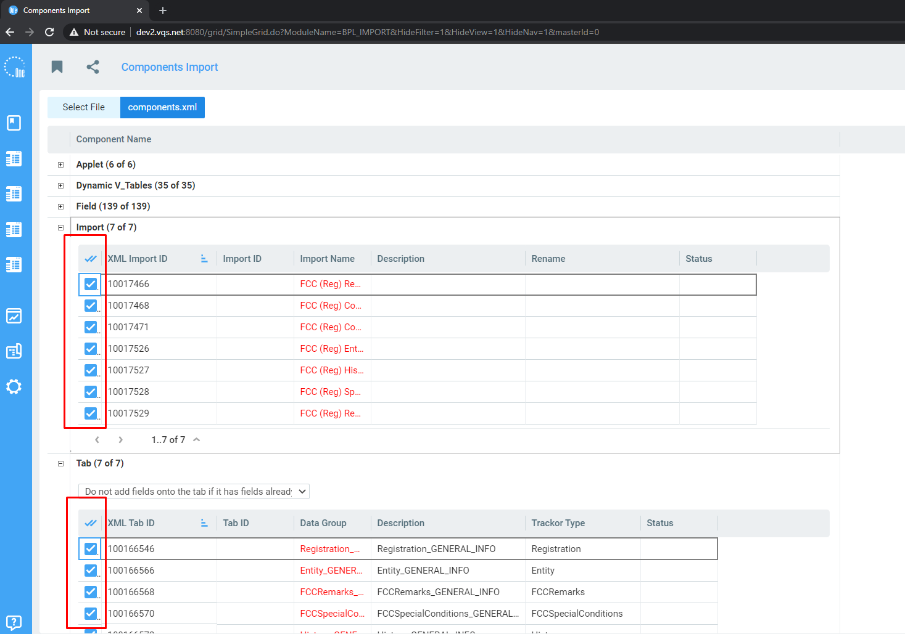
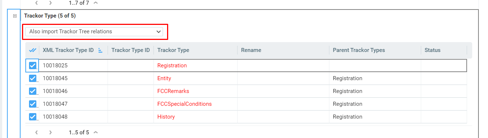
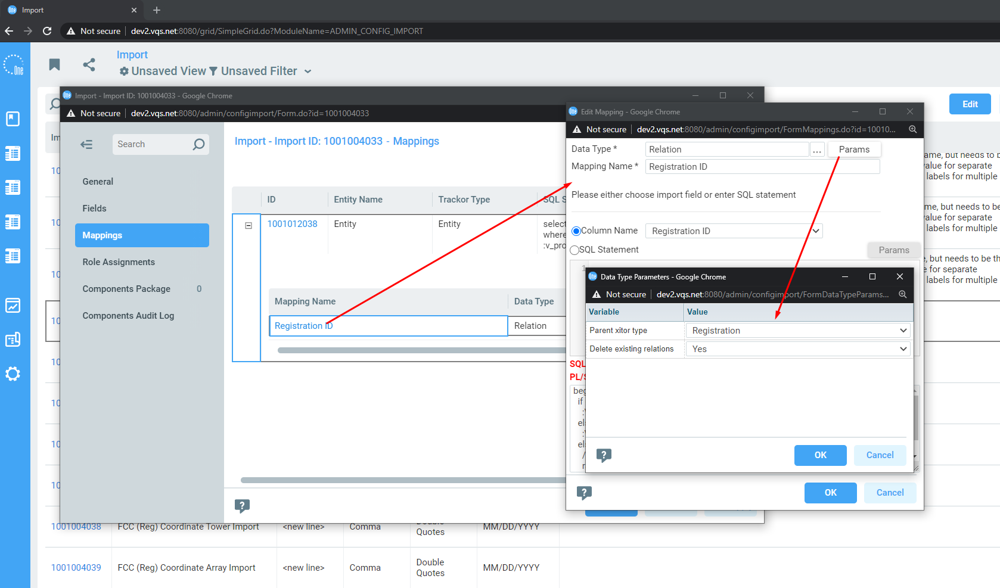

# Installation 

1. Import components
    1. Select components.xml file on Components Import page
    
    2. Select all components to import
    
    3. Also import Trackor Tree relations
    
2. After importing, you need to manually configure Data Type params in the Imports

